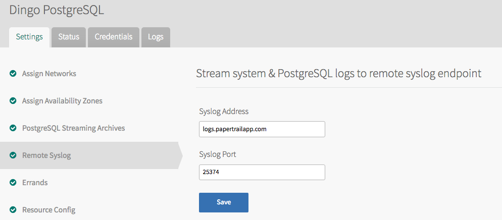

## <a id="requirements"></a>Requirements

* Pivotal Cloud Foundry
* AWS account
* Internet access to Amazon AWS
* Amazon S3 bucket for all PostgreSQL backups and write-ahead log (WAL) segments
* AWS API credentials to read/write files to the Amazon S3 bucket

### <a id="req-security"></a>Security

It is strongly suggested that you create new AWS user that is only given permissions to access this singular bucket. Do not use all-powerful administration credentials that have more privileges than necessary.

## <a id="upload-tile"></a>Upload tile

See [Downloads](download.html) for instructions for downloading the latest tile.

Click "Import a Product" on the left hand side of your Ops Manager dashboard. Select the `dingo-postgresql-x.y.z.pivotal` file to upload.

The "Dingo PostgreSQL™" product will appear in the "Available Products" list. Click "Add" to move it to the Installation Dashboard.

The first time you upload/install the tile it will appear with a red lower border. This means it is not yet ready to be installed - there are mandatory configuration that you will need to provide.

Notably, the Amazon S3 API credentials to allow automatic backups of every database.

## <a id="configuration"></a>Configuration

There are two panels of configuration for Dingo PostgreSQL™ that are specific to this tile.

### <a id="configuration-object-store"></a>Object Store

Every database created by users will be regularly backed up, and incremental write-ahead logs (WAL) uploaded. The minimum data loss from recovery should be up to 10 minutes.

The tile requires that you have already created a bucket on Amazon S3, and have AWS API credentials that have access to this bucket.


### <a id="configuration-syslog"></a>Syslog

It is optional, but highly desirable, to stream all system logs to a central place to give operators visibility. Currently Dingo PostgreSQL™ does not have per-user or per-database logs available to users. Communal syslogs from across the entire system is all that is available.

If you do not yet have an on-prem syslog aggregator such as Splunk or Elastic, then we recommend using a SaaS solution in the meantime. You will need to be able to review and inspect logs to help your users.



## <a id="installation"></a>Installation

Return to the Ops Manager dashboard via the "< Installation Dashboard" link at the top left.

The Dingo PostgreSQL™ tile is now green and is ready to be installed.

Press "Apply Changes".

## <a id="verification"></a>Verification

The `dingo-postgresql` service should be available to all users after installation. Observe it in the marketplace:

```
cf marketplace
```

The output will look like:

```
Getting services from marketplace in org system / space dingo-postgresql as admin...
OK

service           plans                     description
dingo-postgresql  solo, cluster             PostgreSQL with streaming archives.
dingo-s3          essential                 Amazon S3 is storage for the Internet.
```

### <a id="verification-create-service"></a>Create service

To confirm that you and your users can create & delete PostgreSQL database:

```
cf create-service dingo-postgresql solo test-db-solo
cf create-service dingo-postgresql cluster test-db-cluster
```

### <a id="verification-confirm-backups"></a>Confirm backups

Review your operator's system logs for the launch of three Docker containers (one for the `solo` service instance, and two for the `cluster` service instance).

For each of the two service instances there should be logs showing the successful upload of backups to your object store.

```
Mar 16 19:11:47 14ddd22e-719e-4aca-b318-7f291c97fbba docker/cf-c8ce128e-7b4c-4fe7-a533-e9379356f906:  patroni> upload: tmp/sysids/sysid to s3://our-postgresql-backups/backups/6e101b27-ee1b-4f4d-a032-4401a3709ec3/wal/sysids/sysid
Mar 16 19:11:48 14ddd22e-719e-4aca-b318-7f291c97fbba docker/cf-c8ce128e-7b4c-4fe7-a533-e9379356f906:  patroni>         DETAIL: Uploading "pg_xlog/000000010000000000000001" to "s3://our-postgresql-backups/backups/6e101b27-ee1b-4f4d-a032-4401a3709ec3/wal/wal_005/000000010000000000000001.lzo".
Mar 16 19:11:48 14ddd22e-719e-4aca-b318-7f291c97fbba docker/cf-c8ce128e-7b4c-4fe7-a533-e9379356f906:  patroni>         STRUCTURED: time=2016-03-17T02:11:48.811154-00 pid=231 action=push-wal key=s3://our-postgresql-backups/backups/6e101b27-ee1b-4f4d-a032-4401a3709ec3/wal/wal_005/000000010000000000000001.lzo prefix=backups/6e101b27-ee1b-4f4d-a032-4401a3709ec3/wal/ seg=000000010000000000000001 state=begin
Mar 16 19:11:49 14ddd22e-719e-4aca-b318-7f291c97fbba docker/cf-c8ce128e-7b4c-4fe7-a533-e9379356f906:  backup>         DETAIL: Uploading to s3://our-postgresql-backups/backups/6e101b27-ee1b-4f4d-a032-4401a3709ec3/wal/basebackups_005/base_000000010000000000000002_00000040/extended_version.txt.
Mar 16 19:11:50 14ddd22e-719e-4aca-b318-7f291c97fbba docker/cf-c8ce128e-7b4c-4fe7-a533-e9379356f906:  backup>         DETAIL: Uploading to "s3://our-postgresql-backups/backups/6e101b27-ee1b-4f4d-a032-4401a3709ec3/wal/basebackups_005/base_000000010000000000000002_00000040/tar_partitions/part_00000000.tar.lzo".
...
```

Confirm that uploads complete successfully and that there are no timeouts due to Internet access issues.

A completed segment will include `state=complete`:

```
Mar 16 19:11:58 14ddd22e-719e-4aca-b318-7f291c97fbba docker/cf-c8ce128e-7b4c-4fe7-a533-e9379356f906:  patroni>         STRUCTURED: time=2016-03-17T02:11:58.209041-00 pid=253 action=push-wal key=s3://our-dingo-postgresql-backups/backups/6e101b27-ee1b-4f4d-a032-4401a3709ec3/wal/wal_005/000000010000000000000002.00000028.backup.lzo prefix=backups/6e101b27-ee1b-4f4d-a032-4401a3709ec3/wal/ rate=00 seg=000000010000000000000002.00000028.backup state=complete
```

### <a id="verification-delete-service"></a>Delete service

To destroy the test databases:

```
cf delete-service test-db-solo -f
cf delete-service test-db-cluster -f
```
