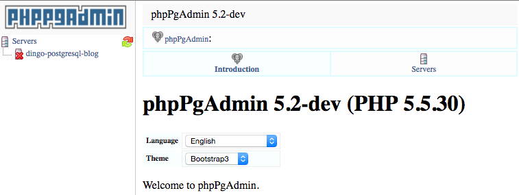
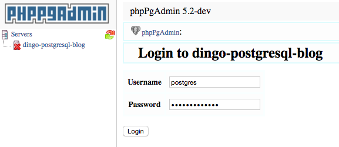
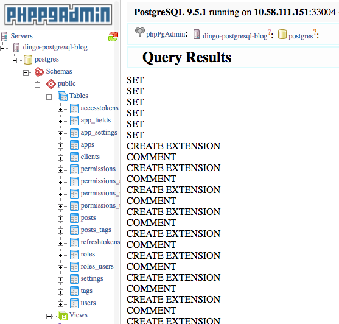

There are many web-based admin GUIs for PostgreSQL and in this section we document how to install a few of them.

## <a id="phppgadmin"></a>phpPgAdmin

[phpPgAdmin](http://phppgadmin.sourceforge.net/doku.php) has a [`phppgadmin-cf` fork](https://github.com/cloudfoundry-community/phppgadmin-cf) maintained by [@ArthurHlt](https://github.com/ArthurHlt) from Orange that makes it easy to run on Pivotal Cloud Foundry and bind to one or more Dingo PostgreSQL ™ in the same space.

### <a id="phppgadmin-deploy"></a>Deploy

[`phppgadmin-cf`](https://github.com/cloudfoundry-community/phppgadmin-cf) is ready to be deployed to your Pivotal Cloud Foundry.

First, target the org/space where your application and Dingo PostgreSQL ™ database are running. This is required so that phppgadmin can bind to the same service instance.

```
cf target -o org -s prod
```

Download and deploy the application:

```
wget https://github.com/cloudfoundry-community/phppgadmin-cf/archive/cf-ready.zip
unzip cf-ready.zip
cd phppgadmin-cf-cf-ready
cf push
```

The running application does not yet have access to your Dingo PostgreSQL ™ service instance.

Bind each service instance and restart:

```
cf bind-service phppgadmin-cfready <dingo-pg-db>
cf restart phppgadmin-cfready
```


### <a id="phppgadmin-loosening-security"></a>Loosen security

If you temporarily need to login to your database using superuser/root privileges then you'll need to reconfigure and redeploy the app.

Edit `conf/config.inc.php` and change the line:

```
$conf['extra_login_security'] = true;
```

to

```
$conf['extra_login_security'] = false;
```

Save and re-deploy the application again:

```
cf push
```

### <a id="phppgadmin-login"></a>Login

When you access phpPgAdmin you will see each of the databases (bound service instances) on the left hand tree view.



Click on the service instance of interest and you will be prompted to login. Use normal credentials or root/superuser credentials if required (see [Loosen security](#phppgadmin-loosening-security) section above to allow root/superuser access).



Your Dingo PostgreSQL ™ service instance contains a single database (called `postgres` in example below). Click the database name (`postgres`).


### <a id="phppgadmin-import-sql"></a>Import SQL

After logging in and navigating to the `postgres` database you can now import SQL files (such as backups from previous PostgreSQL databases).

Click on "SQL" menu item (found between "Schemas" and "Find" options).


Either paste in your SQL query/import, or choose a local `.sql` file to upload and process.


The SQL query results, or the results of importing SQL data, will be displayed.



As shown above, newly imported tables and other schema changes are now navigatable on the left hand side.
