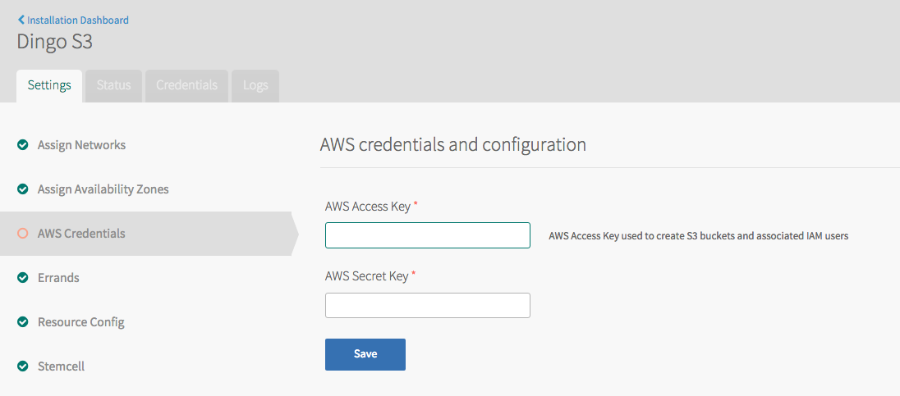

## <a id="requirements"></a>requirements

* Pivotal Cloud Foundry
* 512M in the `system` organization
* AWS credentials with full S3/IAM privileges (see <a href="#iam-user">Setup AWS IAM user</a>)

## <a id="upload-tile"></a>Upload tile

The tile can be downloaded from https://www.dingotiles.com

Click "Import a Product" on the left hand side of your Ops Manager dashboard. Select the `dingo-s3-x.y.z.pivotal` file to upload.

The "Dingo S3" product will appear in the "Available Products" list. Click "Add" to move it to the Installation Dashboard.

The first time you upload/install the tile it will appear with a red lower border. This means it is not yet ready to be installed - there are mandatory configuration that you will need to provide. Notably, the AWS API credentials.

## <a id="iam-user"></a>Setup AWS IAM user

The Dingo S3 tile requires AWS API credentials that will be used for two purposes:

* Create & destroy S3 buckets
* Create & destroy IAM users to have read/write access to those S3 buckets

Create an AWS IAM group with `IAMFullAccess` and `AmazonS3FullAccess` policies:


Create an IAM user with this group.

Enter the user's AWS access & secret keys in the Dingo S3 tile, and press "Save".



## <a id="installation"></a>Installation

Return to the Ops Manager dashboard via the "< Installation Dashboard" link at the top left.

The Dingo S3 tile is now green and is ready to be installed.

Press "Apply Changes".

## <a id="verification"></a>Verification

The `dingo-s3` service should be available to all users after installation. Observe it in the marketplace:

```
cf marketplace
```
